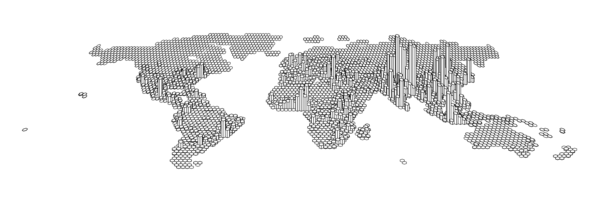

```{r, include = FALSE}
knitr::opts_chunk$set(
  collapse = TRUE,
  comment = "#>"
)
```
<p style="color:red">WARNING: this is a work in progress!</p>

## 1 - Principles

the *mapextrud* R package allows to make extruded maps from sf objects (polygons or multipolygons). For the moment, it is only available on github.

Until a more advanced version is available on CRAN, you can install the package by writing this...

```{r,  eval=FALSE, echo = TRUE}
library(devtools)
install_github("neocarto/mapextrud")
```

... and load the package like that. 

```{r eval=TRUE, warning = FALSE, message=FALSE}
library(mapextrud)
```

## 2 - Basemap setup

The first thing to do before making an extruded map is to deform the basemap to give it a perspective effect. To do this, you can use the *deform()* function.

We Load an example background map on the US.

```{r eval=TRUE, warning = FALSE, message=FALSE}
library(sf)
us <- st_read(system.file("us.gpkg", package="mapextrud"))
```

See below the original basemap

```{r,  eval=TRUE, echo = FALSE, include = FALSE}
if (!file.exists("../img/map1.png")){
png("../img/map1.png", width = 2070, height = 1350, res = 300)
par(mar = c(0,0,0,0))
plot(st_geometry(us), col="#99aed1", border = "white", lwd=0.4)
dev.off()
}
```


```{r,  eval=FALSE, echo = TRUE}
plot(st_geometry(us), col="#99aed1", border = "white", lwd=0.4)
```

](../img/map1.png){ width=100% }

And here, the deformed basemap.

```{r,  eval=TRUE, echo = FALSE, include = FALSE}
if (!file.exists("../img/map2.png")){
png("../img/map2.png", width = 2070, height = 900, res = 300)
par(mar = c(0,0,0,0))
  basemap <- deform(us)
plot(st_geometry(basemap), col="#99aed1", border = "white", lwd=0.4)
dev.off()
}
```

```{r,  eval=FALSE, echo = TRUE}
basemap <- deform(us)
plot(st_geometry(basemap), col="#99aed1", border = "white", lwd=0.4)
```

](../img/map2.png){ width=100% }

To better perceive the deformation, you can add a frame with the *getframe()* function

```{r,  eval=TRUE, echo = FALSE, include = FALSE}
if (!file.exists("../img/map3.png")){
png("../img/map3.png", width = 2060, height = 720, res = 300)
par(mar = c(0,0,0,0))
basemap <- deform(us)
frame <- deform(getframe(us))
plot(st_geometry(frame), col="#e1e5eb", border = "#99aed1", lwd=0.4)
plot(st_geometry(basemap), col="#99aed1", border = "white", lwd=0.4, add = TRUE)
dev.off()
}
```

```{r,  eval=FALSE, echo = TRUE}
basemap <- deform(us)
frame <- deform(getframe(us))
plot(st_geometry(frame), col="#e1e5eb", border = "#99aed1", lwd=0.4)
plot(st_geometry(basemap), col="#99aed1", border = "white", lwd=0.4, add = TRUE)
```

](../img/map3.png){ width=100% }

Notice that you can configure the deformation. The parameter *flatten* indicates the scaling in Y. The parameter *rescale* adjust the deformation of the top and bottom of the figure (c(1,1) = no deformation).

```{r,  eval=TRUE, echo = FALSE, include = FALSE}
if (!file.exists("../img/map4.png")){
png("../img/map4.png", width = 2070, height = 420, res = 300)
par(mar = c(0,0,0,0))
basemap <- deform(us, flatten=0.5, rescale = c(0.5, 3))
frame <- deform(getframe(us), flatten=0.5, rescale = c(0.5, 3))
plot(st_geometry(frame), col="#e1e5eb", border = "#99aed1", lwd=0.4)
plot(st_geometry(basemap), col="#99aed1", border = "white", lwd=0.4, add = TRUE)
dev.off()
}
```

```{r,  eval=FALSE, echo = TRUE}
basemap <- deform(us, flatten=0.5, rescale = c(0.5, 3))
frame <- deform(getframe(us), flatten=0.5, rescale = c(0.5, 3))
plot(st_geometry(frame), col="#e1e5eb", border = "#99aed1", lwd=0.4)
plot(st_geometry(basemap), col="#99aed1", border = "white", lwd=0.4, add = TRUE)
```

](../img/map4.png){ width=100% }

It can also be useful to rotate the basemap with the *rotate()* function.

```{r,  eval=TRUE, echo = FALSE, include = FALSE}
if (!file.exists("../img/map5.png")){
png("../img/map5.png", width = 2070, height = 720, res = 300)
par(mar = c(0,0,0,0))
us2 <- rotate(us, 180)
basemap <- deform(us2)
frame <- deform(getframe(us2))
plot(st_geometry(frame), col="#e1e5eb", border = "#99aed1", lwd=0.4)
plot(st_geometry(basemap), col="#99aed1", border = "white", lwd=0.4, add = TRUE)
dev.off()
}
```

```{r,  eval=FALSE, echo = TRUE}
us2 <- rotate(us, 180)
basemap <- deform(us2)
frame <- deform(getframe(us2))
plot(st_geometry(frame), col="#e1e5eb", border = "#99aed1", lwd=0.4)
plot(st_geometry(basemap), col="#99aed1", border = "white", lwd=0.4, add = TRUE)
```

](../img/map5.png){ width=100% }

## 3 - Build an extruded map

Now we're ready to start extruding... To do this, we use the function - unsustainable suspensions - *extrud()*. Beware, this is still an experimental function. It has bugs and works very slowly. Sorry for that!

Find below a simple example with the default settings.


```{r,  eval=TRUE, echo = FALSE, include = FALSE}
if (!file.exists("../img/map6.png")){
png("../img/map6.png", width = 2070, height = 900, res = 300)
par(mar = c(0,0,0,0))
basemap <- deform(us)
extrude(basemap, var = "pop2019",  lwd = 0.5)
dev.off()
}
```

```{r,  eval=FALSE, echo = TRUE}
basemap <- deform(us)
extrude(basemap, var = "pop2019")
```

](../img/map6.png){ width=100% }

Of course, you can custom the map by changing colors (*col*) and heights (*k*). On the reprentation below, you will probably notice some imperfections. I hope to be able to fix them in the next version of the package. 


```{r,  eval=TRUE, echo = FALSE, include = FALSE}
if (!file.exists("../img/map7.png")){
png("../img/map7.png", width = 2070, height = 900, res = 300)
par(mar = c(0,0,0,0))
basemap <- deform(us)
extrude(basemap, var = "pop2019", col="#99aed1", k =1.8,  lwd = 0.5)
dev.off()
}
```

```{r,  eval=FALSE, echo = TRUE}
basemap <- deform(us)
extrude(basemap, var = "pop2019", col="#99aed1", k =1.8)
```

](../img/map7.png){ width=100% }

## 4 - Another example with *smoothed* data

Find here an example of the number of hospital beds in Paris provided in the SpatialPosition package.

```{r,  eval=TRUE, echo = FALSE, include = FALSE}
if (!file.exists("../img/map8.png")){
png("../img/map8.png", width = 2070, height = 900, res = 300)
par(mar = c(0,0,0,0))
library(SpatialPosition)
library(cartography)
pot <- quickStewart(x = hospital,
                    var = "capacity",
                    span = 800,
                    beta = 2, mask = paris, 
                    returnclass = "sf")

breaks <- sort(c(unique(pot$min), max(pot$max)), decreasing = FALSE)
choroLayer(x = pot,
             var = "center", breaks = breaks,
             legend.pos = "topleft",
             legend.title.txt = "Nb. of Beds")

dev.off()
}
```

```{r,  eval=FALSE, echo = TRUE}
library(SpatialPosition)
library(cartography)
pot <- quickStewart(x = hospital,
                    var = "capacity",
                    span = 800,
                    beta = 2, mask = paris, 
                    returnclass = "sf")

breaks <- sort(c(unique(pot$min), max(pot$max)), decreasing = FALSE)
choroLayer(x = pot,
             var = "center", breaks = breaks,
             legend.pos = "topleft",
             legend.title.txt = "Nb. of Beds")
```

](../img/map8.png){ width=100% }

And here's the same map after extrusion.

```{r,  eval=TRUE, echo = FALSE, include = FALSE}
if (!file.exists("../img/map9.png")){
png("../img/map9.png", width = 2070, height = 900, res = 300)
par(mar = c(0,0,0,0))
library(SpatialPosition)
data("hospital")
# Compute potentials
pot <- quickStewart(x = hospital,
                   var = "capacity",
                   span = 800,
                   beta = 2, mask = paris,
                   returnclass = "sf")
basemap <- deform(pot)
extrude(basemap, "center", k = 4, col = "white", lwd = 0.7, regular = FALSE)
dev.off()
}
```

```{r,  eval=FALSE, echo = TRUE}
library(SpatialPosition)
data("hospital")
# Compute potentials
pot <- quickStewart(x = hospital,
                   var = "capacity",
                   span = 800,
                   beta = 2, mask = paris,
                   returnclass = "sf")
basemap <- deform(pot)
extrude(basemap, "center", k = 4, col = "white", lwd = 0.7, regular = FALSE)
```

](../img/map9.png){ width=100% }


Be informed that, instead of defining a single color, you can use a field defining the color of each object. 

```{r,  eval=TRUE, echo = FALSE, include = FALSE}
if (!file.exists("../img/map10.png")){
png("../img/map10.png", width = 2070, height = 900, res = 300)
par(mar = c(0,0,0,0))
library(SpatialPosition)
data("hospital")
# Compute potentials
pot <- quickStewart(x = hospital,
                   var = "capacity",
                   span = 800,
                   beta = 2, mask = paris,
                   returnclass = "sf")
pot$colors <- cartography::carto.pal(pal1 = "blue.pal" ,n1 = length(pot$id))
basemap <- deform(pot)
extrude(basemap, "center", k = 4, col = "colors", lwd = 0.2, regular = FALSE)
dev.off()
}
```

```{r,  eval=FALSE, echo = TRUE}
library(SpatialPosition)
data("hospital")
# Compute potentials
pot <- quickStewart(x = hospital,
                   var = "capacity",
                   span = 800,
                   beta = 2, mask = paris,
                   returnclass = "sf")
pot$colors <- cartography::carto.pal(pal1 = "blue.pal" ,n1 = length(pot$id))
basemap <- deform(pot)
extrude(basemap, "center", k = 4, col = "colors", lwd = 0.2, regular = FALSE)
```

](../img/map10.png){ width=100% }

## 5 - Height or Volume?

On extruded maps, representing density is equivalent to varying the volume rather than varying the height. In the example below, we also take care to split the multiparty polygons and assign the population to them in proportion to the surface area. 

```{r,  eval=TRUE, echo = FALSE, include = FALSE}
if (!file.exists("../img/map11.png")){
png("../img/map11.png", width = 2070, height = 1400, res = 300)
par(mar = c(0,0,0,0))
us <- st_read(system.file("us.gpkg", package="mapextrud"))
us$area <- st_area(st_geometry(us))
us2 <- st_cast(us,"POLYGON", warn=FALSE)
us2$area2 <- st_area(st_geometry(us2))
us2$pop <-round( us2$pop2019 * as.numeric(us2$area2) / as.numeric(us2$area),0)
us2$density <- us2$pop / as.numeric(us2$area2) * 1000000
basemap <- deform(us2)
extrude(basemap, var = "density" , k = 80, col = "white")
dev.off()
}
```

```{r,  eval=FALSE, echo = TRUE}
us <- st_read(system.file("us.gpkg", package="mapextrud"))
us$area <- st_area(st_geometry(us))
us2 <- st_cast(us,"POLYGON", warn=FALSE)
us2$area2 <- st_area(st_geometry(us2))
us2$pop <-round( us2$pop2019 * as.numeric(us2$area2) / as.numeric(us2$area),0)
us2$density <- us2$pop / as.numeric(us2$area2) * 1000000
basemap <- deform(us2)
extrude(basemap, var = "density" , k = 80, col = "white")
```

](../img/map11.png){ width=100% }

## 6 - What about regular grids?

For regular geometries, you can use the parameter *regular = TRUE* to speed up the calculations. Tip: on irregular basemaps, you can also use this option to test and then remove it to finalize your map. 

Here, an example on world population based on on a sample extracted form gpw-v4 data available [here](https://sedac.ciesin.columbia.edu/data/collection/gpw-v4)

```{r,  eval=TRUE, echo = FALSE, include = FALSE}
if (!file.exists("../img/map12.png")){

library(raster)
library(rnaturalearth)  

png("../img/map12.png", width = 2070, height = 700, res = 300)
par(mar = c(0,0,0,0))

# Map Projection

crs <- "+proj=eqc +lat_ts=0 +lat_0=0 +lon_0=0 +x_0=0 +y_0=0 +ellps=WGS84 +datum=WGS84 +units=m +no_defs"

# Countries

countries <- ne_countries(scale = 110, type = "countries", returnclass = "sf")
countries <- st_transform(countries, crs)
countries <- countries[countries$adm0_a3 != "ATA",]
countries <- st_sf(st_buffer(st_union(countries),1))

# World population

r <- raster(system.file("worldpop.tif", package="mapextrud"))
dots <- as(r, 'SpatialPointsDataFrame')
dots <- st_as_sf(dots)
dots <- st_transform(dots, crs)
colnames(dots) <- c("pop2020","geometry")
grid <- st_make_grid(countries, cellsize = 300000, square = FALSE)
grid <- aggregate(dots["pop2020"], grid, sum)

# Cartography

basemap <- deform(grid, flatten = 1.2)
extrude(x = basemap, var = "pop2020", k = 4, col = "white", lwd = 0.4, regular = TRUE, add = F)

dev.off()
}

```


```{r,  eval=FALSE, echo = TRUE}

library(raster)
library(rnaturalearth)  

# Map Projection

crs <- "+proj=eqc +lat_ts=0 +lat_0=0 +lon_0=0 +x_0=0 +y_0=0 +ellps=WGS84 +datum=WGS84 +units=m +no_defs"

# Countries

countries <- ne_countries(scale = 110, type = "countries", returnclass = "sf")
countries <- st_transform(countries, crs)
countries <- countries[countries$adm0_a3 != "ATA",]
countries <- st_sf(st_buffer(st_union(countries),1))

# World population

r <- raster(system.file("worldpop.tif", package="mapextrud"))
dots <- as(r, 'SpatialPointsDataFrame')
dots <- st_as_sf(dots)
dots <- st_transform(dots, crs)
colnames(dots) <- c("pop2020","geometry")
grid <- st_make_grid(countries, cellsize = 300000, square = FALSE)
grid <- aggregate(dots["pop2020"], grid, sum)

# Cartography

basemap <- deform(grid, flatten = 1.2)
extrude(x = basemap, var = "pop2020", k = 4, col = "white", lwd = 0.2, regular = TRUE, add = F)

```

](../img/map12.png){ width=100% }

As everything is based on *sf*, you can simply combine different layers to finalize the map. Here, we only keep the cells where the population is greater than 5 million people. Thus, 77 % of the world's population is represented on the map.

```{r,  eval=TRUE, echo = FALSE, include = FALSE}
if (!file.exists("../img/map13.png")){
  
png("../img/map13.png", width = 2070, height = 700, res = 300)
par(mar = c(0,0,0,0))
  
library(raster)
library(rnaturalearth)

# Map Projection

crs <- "+proj=eqc +lat_ts=0 +lat_0=0 +lon_0=0 +x_0=0 +y_0=0 +ellps=WGS84 +datum=WGS84 +units=m +no_defs"

# Countries

countries <- ne_countries(scale = 110, type = "countries", returnclass = "sf")
countries <- st_transform(countries, crs)
countries <- countries[countries$adm0_a3 != "ATA",]
countries <- st_sf(st_buffer(st_union(countries),1))

# World population

r <- raster(system.file("worldpop.tif", package="mapextrud"))
dots <- as(r, 'SpatialPointsDataFrame')
dots <- st_as_sf(dots)
dots <- st_transform(dots, crs)
colnames(dots) <- c("pop2020","geometry")
grid <- st_make_grid(countries, cellsize = 200000, square = FALSE)
grid <- aggregate(dots["pop2020"], grid, sum)

# Deform

basemap <- deform(grid, flatten = 1.2)
frame <- deform(getframe(countries), flatten = 1.2)
world <- deform(countries, flatten = 1.2)

# Selection

total <- sum(basemap$pop2020, na.rm = TRUE)
basemap <- basemap[basemap$pop2020 > 5000000 & !is.na(basemap$pop2020),]
pct <- round((sum(basemap$pop2020) / total) * 100,0)

# Cartography

plot(st_geometry(frame), col = "#c5dbed", lwd = 0.2)
plot(st_geometry(world), col = "#e3dbca", border = "#7f8aad", lwd = 0.3, add = TRUE)
extrude(x = basemap, var = "pop2020", k = 5, col = "#e65c5c", lwd = 0.2, regular = TRUE, add = TRUE)

# Layout
text(x=  -28000000, y =11500000, "An Urban World (population in 2020)", cex = 0.9, col = "#5e698a", pos = 4)
text(x=  42000000, y = -11500000, "Made with the R package mapextrud", cex = 0.6, col = "#414245", pos = 2)
  
  
dev.off()
}

```


```{r,  eval=FALSE, echo = TRUE}

library(raster)
library(rnaturalearth)

# Map Projection

crs <- "+proj=eqc +lat_ts=0 +lat_0=0 +lon_0=0 +x_0=0 +y_0=0 +ellps=WGS84 +datum=WGS84 +units=m +no_defs"

# Countries

countries <- ne_countries(scale = 110, type = "countries", returnclass = "sf")
countries <- st_transform(countries, crs)
countries <- countries[countries$adm0_a3 != "ATA",]
countries <- st_sf(st_buffer(st_union(countries),1))

# World population

r <- raster(system.file("worldpop.tif", package="mapextrud"))
dots <- as(r, 'SpatialPointsDataFrame')
dots <- st_as_sf(dots)
dots <- st_transform(dots, crs)
colnames(dots) <- c("pop2020","geometry")
grid <- st_make_grid(countries, cellsize = 200000, square = FALSE)
grid <- aggregate(dots["pop2020"], grid, sum)

# Deform

basemap <- deform(grid, flatten = 1.2)
frame <- deform(getframe(countries), flatten = 1.2)
world <- deform(countries, flatten = 1.2)

# Selection

total <- sum(basemap$pop2020, na.rm = TRUE)
basemap <- basemap[basemap$pop2020 > 5000000 & !is.na(basemap$pop2020),]
pct <- round((sum(basemap$pop2020) / total) * 100,0)

# Cartography

plot(st_geometry(frame), col = "#c5dbed", lwd = 0.2)
plot(st_geometry(world), col = "#e3dbca", border = "#7f8aad", lwd = 0.3, add = TRUE)
extrude(x = basemap, var = "pop2020", k = 5, col = "#e65c5c", lwd = 0.2, regular = TRUE, add = TRUE)

# Layout
text(x=  -28000000, y =11500000, "An Urban World (population in 2020)", cex = 0.9, col = "#5e698a", pos = 4)
text(x=  42000000, y = -11500000, "Made with the R package mapextrud", cex = 0.6, col = "#414245", pos = 2)

```

](../img/map13.png){ width=100% }


  
